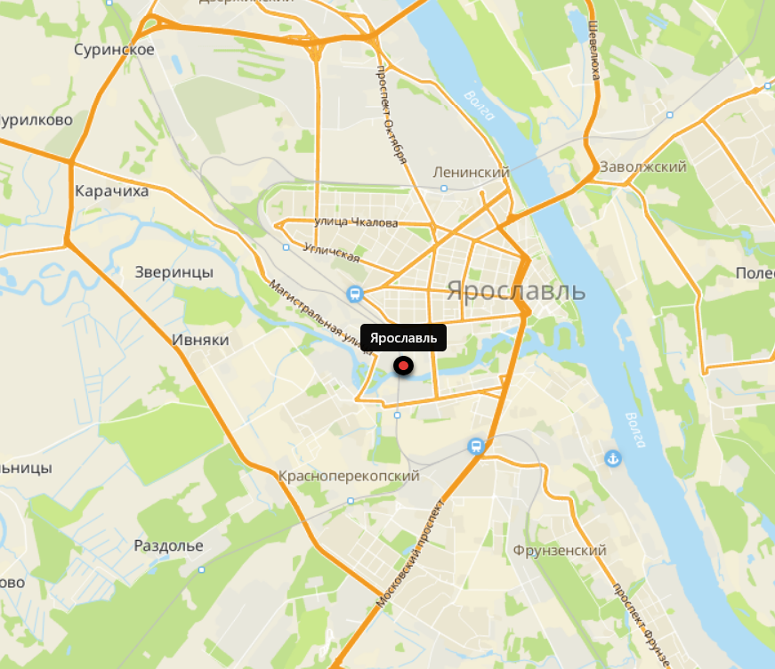
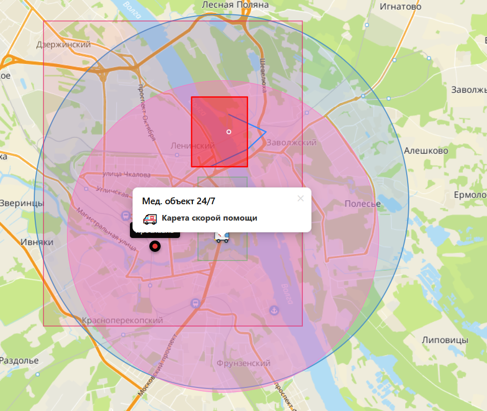

## dkxce Simple Tiles JS Map

src <a href="map.html">map.html</a> 
 
 
**Supports**:
- single marker
- hint(s)
- points
- circles
- rectangles
- kml layers

**Demo**:
- https://dkxce.github.io/temporary/map.html
- https://dkxce.github.io/temporary/map.html?kml=bWFwLmttbA&lat=44.3605&lon=40.3&text=bWFwLmttbA
- https://dkxce.github.io/temporary/map.html?kml=Z2Zpc2h0LmttbA&lat=44.125&lon=39.895&text=Z2Zpc2h0LmttbA&zoom=11 
